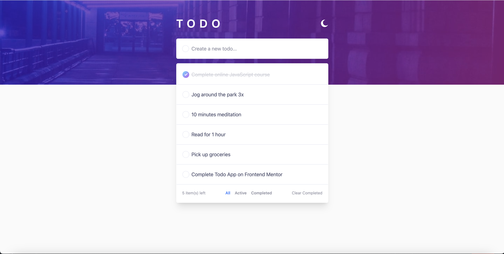
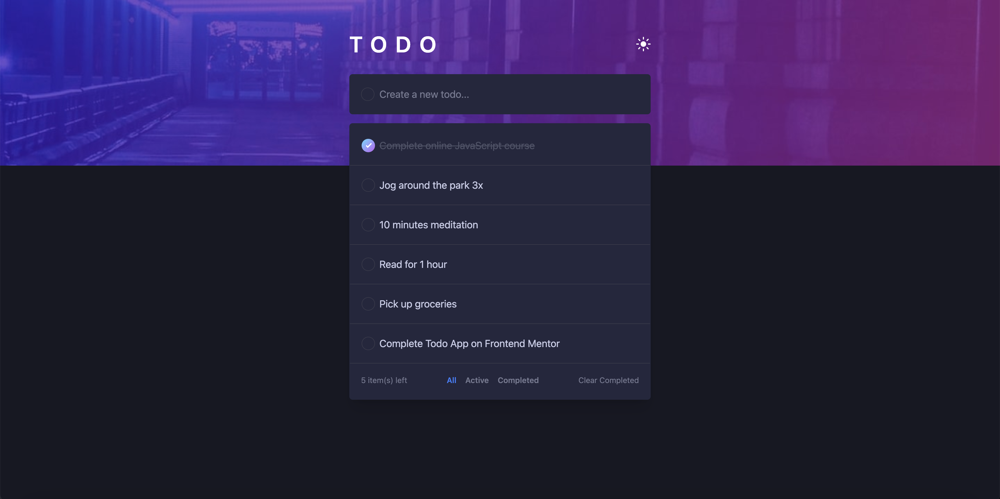

# Frontend Mentor - Todo app solution

This is a solution to the [Todo app challenge on Frontend Mentor](https://www.frontendmentor.io/challenges/todo-app-Su1_KokOW). Frontend Mentor challenges help you improve your coding skills by building realistic projects. 

## Table of contents

- [Overview](#overview)
  - [The challenge](#the-challenge)
  - [Screenshot](#screenshot)
  - [Links](#links)
- [My process](#my-process)
  - [Built with](#built-with)
- [Author](#author)

## Overview

### The challenge

Users should be able to:

- Add new todos to the list
- Mark todos as complete
- Delete todos from the list
- Filter by all/active/complete todos
- Clear all completed todos
- Toggle light and dark mode
- View the optimal layout for the app depending on their device's screen size
- See hover states for all interactive elements on the page
- <s>**Bonus**: Drag and drop to reorder items on the list</s>
- <s>**Bonus**: Build this project as a full-stack application</s>

### Screenshot

Light Theme

Dark Theme

### Links

- [Solution URL](https://github.com/aserputko/react-todo-app)
- [Live Site URL](https://aserputko.github.io/react-todo-app/)

## My process

### Built with

- [React](https://react.dev/)
- [Redux Toolkit](https://redux-toolkit.js.org/)
- [Tailwind CSS](https://tailwindcss.com/)
- [Jest](https://jestjs.io/)
- [Github Actions](https://github.com/features/actions)

## Author

- Frontend Mentor - [@aserputko](https://www.frontendmentor.io/profile/aserputko)

